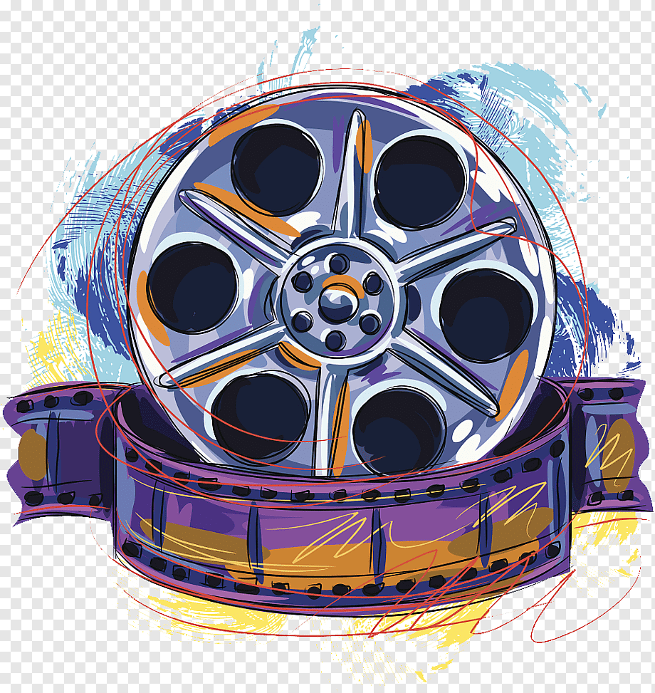

### Hi there, I'm Emre! 👋    

### I'm a software engineer and i development c projects and websites.   

--- 
- 👩🏻‍💻 I’m currently working on my own projects
- 🌱 I’m currently learning C,Flutter, Machine Learning, Swift. 

- 📫 How to reach me:    

  
- 😄 Pronouns: Software Engineer
- 💪🏼 Future Goals: Exploring new technologies and developing software solutions. - Never stop creating new ideas.
- 🌸 Fun Facts: Books, travel and cinema.  

---
<h4 align="center">Visitor's count :eyes:</h4>

<h4 align="center">Top langs 🔮</h4>

  </tbody>
</table>
